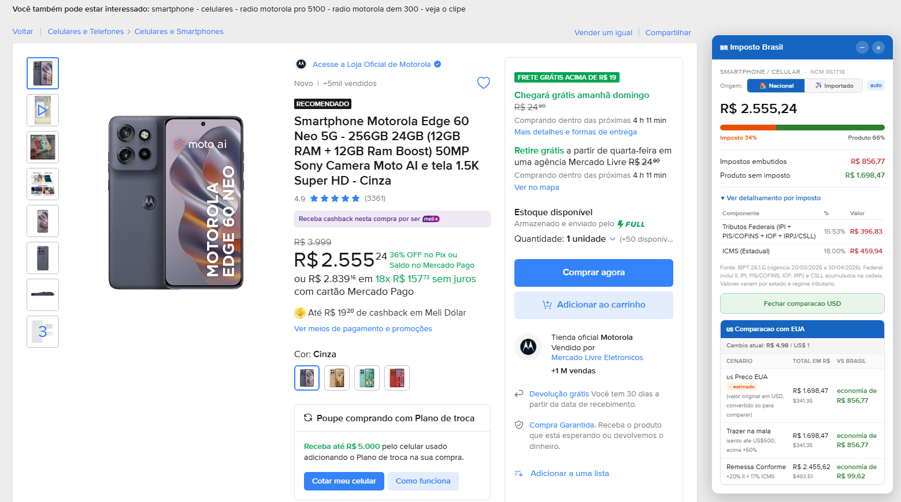

# Imposto Brasil


Extensão para Chrome que estima os impostos embutidos em produtos do Mercado Livre e compara com o preço equivalente fora do país.

Os valores são estimativas — usa a base pública do IBPT pra achar a alíquota por NCM, com fallback por categoria quando não encontra. Não substitui cálculo fiscal oficial.

## Instalar

Disponível na [Chrome Web Store](https://chromewebstore.google.com/detail/imposto-brasil/eimgpbheiklccnaamloobfahaaodjjjg).

Pra rodar local:

1. `chrome://extensions` → ativa o modo desenvolvedor.
2. `Carregar sem compactação` → seleciona esta pasta.
3. Abre uma página de produto em `mercadolivre.com.br`.

## Preview




## Empacotar

```powershell
.\scripts\package-extension.ps1
```

Gera o zip em `dist/` pronto pra Chrome Web Store.

## Licença

MIT.
